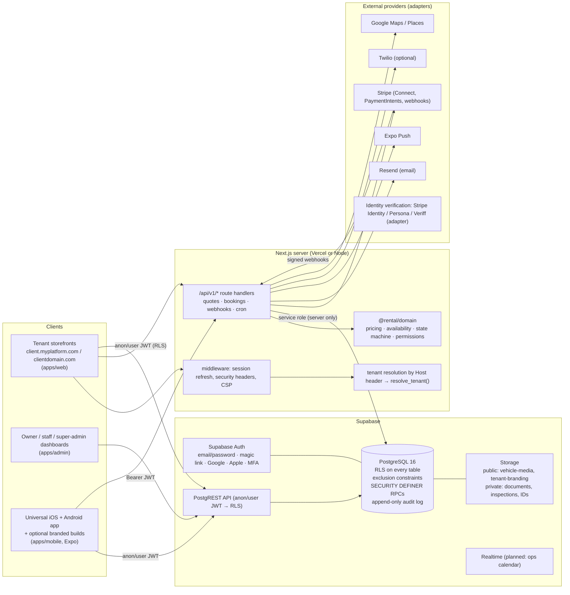
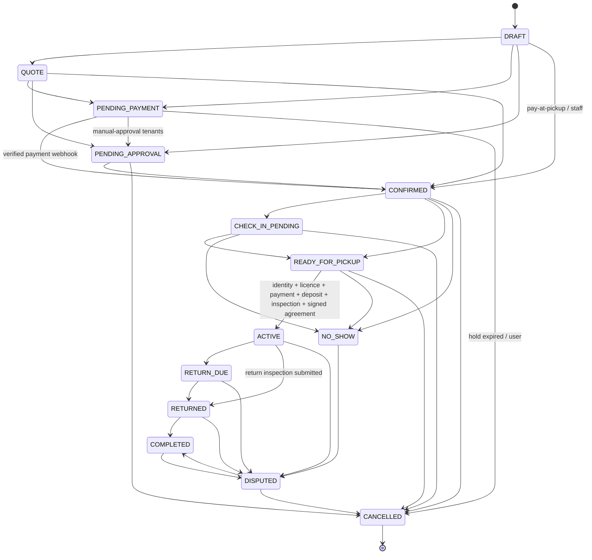

# Architecture

A multi-tenant, white-label car-rental platform ("Shopify for rental companies"). One codebase serves every rental company. Each company's configuration lives in the database; builds are not forked per customer.

- [A. System diagram](#a-system-diagram)
- [B. Folder structure](#b-folder-structure)
- [C. Database ERD](#c-database-erd)
- [D. Booking state machine](#d-booking-state-machine)
- [E. Tenant and RLS security model](#e-tenant--rls-security-model)
- [F. Payment and deposit flow](#f-payment--deposit-flow)
- [G. Implementation roadmap and status](#g-implementation-roadmap--status)
- [Architecture decisions](#architecture-decisions)

---

## A. System diagram



**Trust boundaries**

| Caller | Credential | What protects data |
|---|---|---|
| Browser or mobile app | anon key + user JWT | RLS policies, column guard triggers, and RPC permission checks |
| Next.js route handlers | user JWT, validated with `auth.getUser()` | Server code checks the permission, then the RPC re-checks it in SQL |
| Trusted server operations (pricing reads, booking creation, webhooks, cron) | service role, server only | Code-level authorization, plus the `create_booking` invariants and DB constraints |
| Stripe | webhook signature | `constructEvent` verification, unique `(provider, event_id)`, and an atomic claim |

---

## B. Folder structure

```
.
├── apps/
│   ├── web/                 Next.js App Router: tenant storefronts + API routes
│   │   └── src/{app,components,lib}
│   ├── mobile/              Expo Router app (universal + white-label builds)
│   │   ├── app.config.ts    selects clients/<APP_VARIANT>/config.ts
│   │   └── eas.json         development / preview / production (+ per-client) profiles
│   └── admin/               Next.js: owner/staff dashboard (/t/<slug>) and platform console (/platform)
├── clients/                 white-label mobile build configs (one folder per client)
├── packages/
│   ├── types/               shared enums, models, business error codes
│   ├── domain/              pure business logic: money, pricing, availability, state machine, permissions
│   ├── validation/          Zod schemas for every API input
│   ├── database/            RPC payload types, error mapping, DB integration tests
│   ├── auth/                Supabase client factories + server authorization helpers
│   ├── api-client/          typed data access shared by web + mobile
│   ├── payments/            provider port, Stripe adapter, webhook processor, deposit planning
│   ├── notifications/       template resolution/rendering + email/push/SMS adapters
│   ├── maps/                maps provider port, Google adapter, distance and delivery fees
│   ├── localization/        en + sq catalogues, money and timezone formatting
│   ├── design-tokens/       palette, typography, WCAG-checked tenant themes
│   ├── ui/                  shared web UI recipes
│   ├── server/              trusted server services: booking, payments, deposits, refunds, PDFs, jobs
│   ├── config/              environment validation
│   └── testing/             DB test harness (impersonate anon/user/service), demo IDs
├── supabase/
│   ├── migrations/          ordered SQL migrations (schema, RLS, engine RPCs)
│   ├── seed.sql             Apex Drive Rentals demo tenant (dev/preview only)
│   ├── tests/shim/          plain-Postgres emulation of Supabase auth/storage for CI
│   └── config.toml          Supabase CLI config
├── e2e/                     Playwright suite (storefront, dashboards, MFA, cron) against the local stack
├── tools/local-stack/       Docker-free Supabase-compatible stack (GoTrue + PostgREST + storage emulator)
├── scripts/                 db-reset-local.sh, db-test.sh, gen-db-types.mjs
├── docs/                    this documentation
└── .github/workflows/       ci.yml, deploy-database.yml, mobile-build.yml
```

The dependency rule: `apps/* → packages/*`, and `domain` depends only on `types`. Business logic never lives in visual components. Components call `domain` functions or server APIs.

---

## C. Database ERD

The full DDL is in [`supabase/migrations`](../supabase/migrations). Column-level detail is in [DATABASE.md](DATABASE.md). This diagram shows the core relationships. Nearly every table carries `tenant_id`, and child tables use **composite foreign keys `(tenant_id, parent_id)`**, so a row can never reference another tenant's data.

```mermaid
erDiagram
  tenants ||--|| tenant_settings : has
  tenants ||--|| tenant_branding : has
  tenants ||--o{ tenant_domains : "served at"
  tenants ||--o{ tenant_subscriptions : "billed by"
  subscription_plans ||--o{ tenant_subscriptions : ""
  tenants ||--o{ memberships : employs
  auth_users ||--o{ memberships : ""
  roles ||--o{ role_permissions : ""
  permissions ||--o{ role_permissions : ""
  memberships ||--o{ membership_permission_overrides : ""
  auth_users ||--|| profiles : ""
  tenants ||--o{ branches : ""
  branches ||--o{ vehicles : "based at"
  vehicle_classes ||--o{ vehicle_class_members : ""
  vehicles ||--o| vehicle_class_members : ""
  vehicles ||--o{ vehicle_images : ""
  vehicles ||--o{ vehicle_documents : ""
  vehicles ||--o{ vehicle_availability_blocks : "occupied by"
  vehicles ||--o{ vehicle_transfers : ""
  vehicles ||--o{ maintenance_records : ""
  tenants ||--o{ customers : "CRM record per tenant"
  auth_users ||--o{ customers : "optional login"
  customers ||--o{ driver_licenses : ""
  customers ||--o{ customer_documents : ""
  customers ||--o{ customer_restrictions : "append-only"
  customers ||--o{ bookings : ""
  bookings ||--o{ booking_price_lines : "immutable snapshot"
  bookings ||--o{ booking_extras : ""
  bookings ||--o{ booking_status_history : ""
  bookings ||--o{ booking_vehicle_assignments : ""
  bookings ||--o{ vehicle_availability_blocks : "BOOKING block"
  bookings ||--o{ payments : ""
  payments ||--o{ payment_transactions : "ledger"
  payments ||--o{ refunds : ""
  bookings ||--o| security_deposits : ""
  bookings ||--o{ invoices : ""
  bookings ||--o| rental_agreements : ""
  rental_agreements ||--o{ signatures : ""
  bookings ||--o{ vehicle_inspections : "PICKUP / RETURN"
  vehicle_inspections ||--o{ inspection_photos : ""
  vehicle_inspections ||--o{ vehicle_damages : ""
  bookings ||--o| reviews : "verified only"
  customers ||--o{ message_threads : ""
  message_threads ||--o{ messages : ""
  tenants ||--o{ audit_logs : "append-only"
```



**Key invariants enforced by the database**

| Invariant | Mechanism |
|---|---|
| No double booking (including turnaround buffer, maintenance, cleaning, transfers, manual blocks) | `vehicle_availability_blocks` has `EXCLUDE USING gist (vehicle_id WITH =, period WITH &&) WHERE (released_at IS NULL)` |
| Class-mode capacity | `pg_advisory_xact_lock` per class + spare-capacity check inside `create_booking` |
| Valid lifecycle | `booking_status_transitions` table + `enforce_booking_rules` trigger |
| Immutable price snapshot | trigger rejects price changes after `PENDING_PAYMENT` |
| Money never negative, never floats | `bigint` minor units + `CHECK (… >= 0)` |
| Refunds ≤ captured | `guard_refund_total` trigger with a row lock |
| Webhooks processed once | `UNIQUE (provider, event_id)` + conditional status claim |
| Idempotent booking creation | `UNIQUE (tenant_id, idempotency_key)` |
| Odometer never decreases | inspection trigger + vehicle guard |
| Damage charges need a human | `CHECK` on `vehicle_damages` and `payments` (`approved_by` for DAMAGE/LATE_FEE) |
| Audit log immutable | `BEFORE UPDATE/DELETE` trigger raises; no DML grants |

---

## D. Booking state machine

The state machine is defined twice: in SQL (`public.booking_status_transitions`) and in TypeScript (`packages/domain/src/booking/state-machine.ts`). A parity test fails CI if the two differ.



**Side effects** (trigger `after_booking_status`):
- Every change writes `booking_status_history` with actor and reason.
- `CONFIRMED` clears the hold expiry.
- `CANCELLED` and `NO_SHOW` release the occupancy block.
- `ACTIVE` sets the vehicle to `RENTED`.
- `RETURNED` shrinks the block to the actual return time plus buffer, and sets the vehicle to `CLEANING`.

**Who may transition** (`public.transition_booking`):

| Target | Allowed callers |
|---|---|
| `CANCELLED` | Staff with `bookings.cancel`, or the booking's customer before pickup time (fee rules apply) |
| `NO_SHOW`, `DISPUTED` | Staff with `bookings.override` or `bookings.cancel` |
| All other states | Staff with `bookings.write` plus access to the pickup branch |
| `ACTIVE` | Also requires the pickup gate checks unless the caller has `bookings.override` |

---

## E. Tenant and RLS security model

1. **Every tenant-owned row has `tenant_id`**, and `tenant_id` is immutable (trigger `freeze_tenant_id`).
2. **RLS is enabled on every table** (a CI parity test asserts this). If no policy grants access, access is denied.
3. **Authorization helpers** live in the private `app` schema. They are `SECURITY DEFINER` with `search_path = ''`, and a test asserts that every definer function pins its search path:
   - `app.has_permission(tenant, 'bookings.read')` evaluates: active membership → per-member override → role default. A suspended tenant becomes read-only; an archived tenant gets no access.
   - `app.has_branch_access`, `app.owns_customer`, `app.owns_booking`, `app.is_platform_admin`, `app.tenant_is_public`.
4. **Policy shapes**
   - Staff tables use `USING (app.has_permission(tenant_id, '<x>.read'))` and `WITH CHECK (app.has_permission(tenant_id, '<x>.write'))`.
   - Customer self-service is limited to the customer's own rows through `user_id = auth.uid()` or ownership helpers.
   - Public storefront data (branches, extras, tax rules, reviews, branding) is readable only for `ACTIVE` tenants.
   - Sensitive vehicle fields (VIN, purchase price, plate) are never public. The `catalog_vehicles` view exposes safe columns only.
5. **Column-guard triggers** close the gaps that row-level policies leave open:
   - Tenants cannot change their own status, slug or ownership.
   - Tenants cannot self-verify domains.
   - Staff cannot assign roles at or above their own rank.
   - `vehicles.status` holders can only change operational fields.
   - Customers cannot verify themselves or lift their own restrictions.
   - Damage decisions are stamped with the deciding user.
6. **Money and booking tables are read-only over the API.** `INSERT`, `UPDATE` and `DELETE` are revoked from `authenticated`. Mutations go through RPCs that check permissions, or through trusted server code.
7. **The service role is server-only.** Only `apps/web/src/lib/supabase/server.ts` creates it; the module imports `server-only` and the factory throws in a browser. Mobile never has it.
8. **Proof:** `packages/database/test/tenant-isolation.test.ts` and `rls.test.ts` run against real Postgres in CI. See [TESTING.md](TESTING.md).

The platform super admin is a row in `platform_admins`, separate from tenant roles. Admins get `SELECT` on everything and write access to platform tables (plans, tenants, flags, domains). They still cannot rewrite financial history, because bookings and payments have no admin DML path.

---

## F. Payment and deposit flow

```mermaid
sequenceDiagram
  autonumber
  participant C as Customer (web/mobile)
  participant API as /api/v1/bookings
  participant DB as Postgres (create_booking)
  participant S as Stripe
  participant WH as /api/v1/webhooks/stripe

  C->>API: choices only (vehicle, dates, extras, code, idempotencyKey)
  API->>API: auth.getUser(); Zod validate; rate limit
  API->>DB: load tenant rules (service role) → @rental/domain quote()
  API->>DB: rpc create_booking(payload)  — re-validates totals, ownership, window
  DB-->>API: booking PENDING_PAYMENT + hold block (expires in hold_minutes)
  API->>S: PaymentIntent(due_now, idempotency key, application fee via Connect)
  API-->>C: clientSecret
  C->>S: confirm with Payment Element (card / Apple Pay / Google Pay, 3DS)
  S-->>WH: payment_intent.succeeded (signed)
  WH->>WH: verify signature → insert webhook_events (unique) → claim
  WH->>DB: payments SUCCEEDED + ledger row → record_booking_payment()
  DB-->>WH: CONFIRMED (or HOLD_LOST → automatic full refund)
  Note over C: The browser redirect never marks anything paid
```

**Security deposit** (a separate concept from the rental charge):
1. At booking, `planDeposit()` decides between two paths:
   - `AUTHORIZE_NOW`: the pickup is close and the rental is short.
   - `SAVE_METHOD_AND_AUTHORIZE_LATER`: the payment method is saved with `setup_future_usage=off_session`, and a scheduled job authorizes it `deposit_authorize_hours_before` pickup.
2. Card authorizations expire after about 7 days. Long rentals are flagged by `needsReauthorization()`.
3. At return, staff confirm any charges (damage, fuel, mileage, late return). `depositCaptureAmount()` captures only those confirmed charges, capped at the authorized amount. The rest is released by cancelling the PaymentIntent. A damage capture requires `vehicle_damages.decided_by`; AI output alone can never trigger one.

**Refunds** go through `refunds`, which requires an idempotency key and is guarded against over-refunding. The provider refund uses the same key, and the webhook finalizes the refund status.

**Platform revenue** comes from subscriptions on `tenant_subscriptions`, plus an optional application fee per booking payment. The fee is computed by `platformFee()` from the plan or a per-tenant override: `NONE`, `PERCENTAGE`, `FIXED` or `CUSTOM`. Nothing is hard-coded.

See [PAYMENTS.md](PAYMENTS.md).

---

## G. Implementation roadmap and status

Legend: ✅ done and tested · 🟡 partial · ⬜ not started. "Done" means implemented and verified by the tests or builds listed in [TESTING.md](TESTING.md). It does not mean production-proven with live credentials.

| Phase | Scope | Status |
|---|---|---|
| 1 | Monorepo (pnpm + Turborepo), strict TS, lint, CI | ✅ |
| 2 | Database schema: 79 tables, constraints, indexes, 19 migrations | ✅ |
| 3 | Auth / tenant / RBAC / RLS + column guards; dashboard MFA (TOTP, AAL2 gate) | ✅ |
| 4 | Design system (tokens, WCAG-checked tenant theming) | ✅ tokens + web/admin recipes + mobile primitives |
| 5 | Tenant onboarding (11-step wizard, save and resume) | ✅ |
| 6 | Branches and fleet (CRUD, images, documents, classes, transfers, QR codes) | ✅ |
| 7 | Pricing engine + rule management UI | ✅ |
| 8 | Availability (exclusion constraint, buffers, holds, class capacity) | ✅ |
| 9 | Search and vehicle pages | ✅ web + mobile |
| 10 | Booking engine (create, modify, transition, assign, cancel; staff walk-in bookings) | ✅ |
| 11 | Payments (Stripe intents, Connect onboarding, webhooks, deposits, refunds, balance charges) | ✅ code + tests against a provider test double; 🟡 not yet exercised with live Stripe test keys |
| 12 | Customer booking management (list, detail, cancel, documents, data export, deletion request) | ✅ web + mobile |
| 13 | Owner dashboard | ✅ |
| 14 | Staff pickup and return (web + mobile offline inspections, QR scan) | ✅ |
| 15 | Agreements and signatures (PDF, content-hash-bound signatures, invoices) | ✅ |
| 16 | Maintenance and damages (incl. advisory AI review) | ✅ |
| 17 | Notifications and messaging (queue, dispatcher, email/push/SMS adapters, inbox) | ✅ code; 🟡 providers need real keys |
| 18 | Analytics (dashboard KPIs, charts, CSV exports) | ✅ |
| 19 | Super admin (tenants, plans, flags, catalog, system health, privacy, audit) | ✅ |
| 20 | Website and custom domains (content, legal pages, DNS verification job) | ✅ |
| 21 | Universal mobile tenant routing (code, deep links, companies near me) | ✅ |
| 22 | White-label build configuration | ✅ |
| 23 | Testing (unit, DB integration, stack services, Playwright E2E) | ✅; ⬜ native mobile UI tests (Maestro/Detox) |
| 24 | Security hardening (shared rate limits, nonce CSP, MFA, error reporting, retention, identity verification, dependency audit) | ✅ code; 🟡 see [SECURITY.md](SECURITY.md) open items (Auth CAPTCHA settings, pen test, live credentials) |
| 25 | Deployment | 🟡 docs + workflows; no environment provisioned |

---

## Architecture decisions

1. **The database is the final arbiter for booking integrity.** Frontend availability checks are only for display. A GiST exclusion constraint on a single occupancy table covers bookings, maintenance, cleaning, transfers and manual blocks, so every code path is covered by construction.
2. **Pricing runs in TypeScript on the server, and the result is validated in SQL.** The engine is deterministic and unit-tested. The browser never sends prices. `create_booking` re-checks that the line items sum to the total and that no amount is negative.
3. **Money is integer minor units** (`bigint` in SQL, safe integers in TS). Rate multiplications use `BigInt`.
4. **Rental days are counted on the branch's wall clock**, so a DST change never adds or removes a billable day. Timestamps are stored in UTC.
5. **Each tenant gets its own customer record per person** (`customers.user_id` is optional). This keeps CRM data, documents and restrictions tenant-private, while one login works across tenants.
6. **One universal app by default.** Branded builds are opt-in configurations (`clients/<slug>`), never forks.
7. **Provider adapters** (payments, maps, notifications, identity) sit behind ports, so providers can be swapped without touching business logic.
